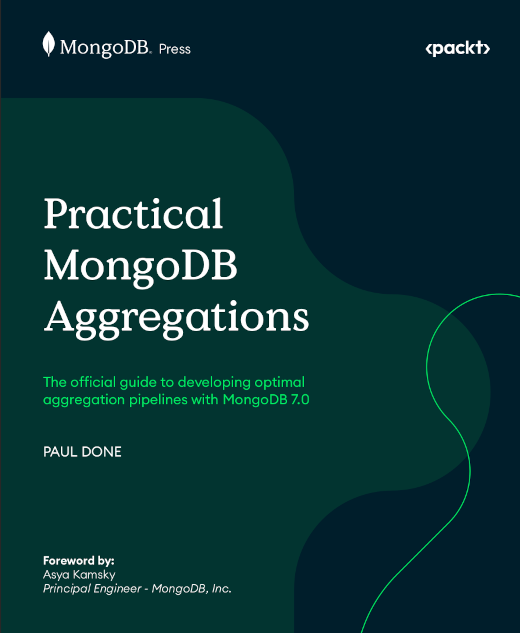

# ADVERT: Book Version To Purchase

As part of the official MongoDB Inc. series of books, called _MongoDB Press_, paper and electronic versions of this book are published by [Packt](https://www.packtpub.com/). The Packt version of the book includes extra information on some topics and two additional example chapters. 

&nbsp;

&nbsp;

You can purchase the book from the [Packt](https://www.packtpub.com/product/practical-mongodb-aggregations/9781835080641) website, [Amazon](https://www.amazon.com/Practical-MongoDB-Aggregations-developing-aggregation-ebook/dp/B0CGVKYGPT), or other book retailers.

