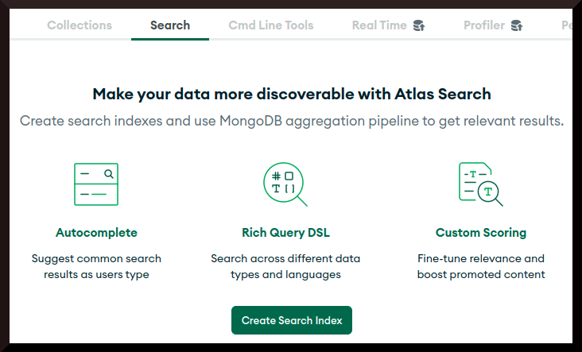
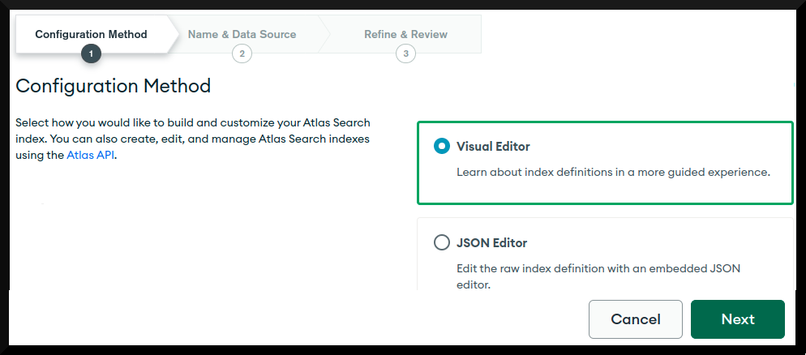
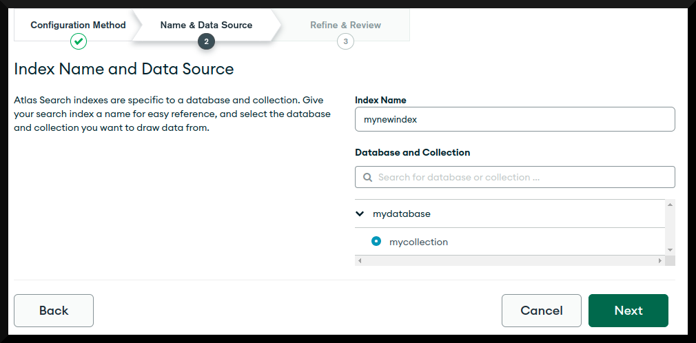
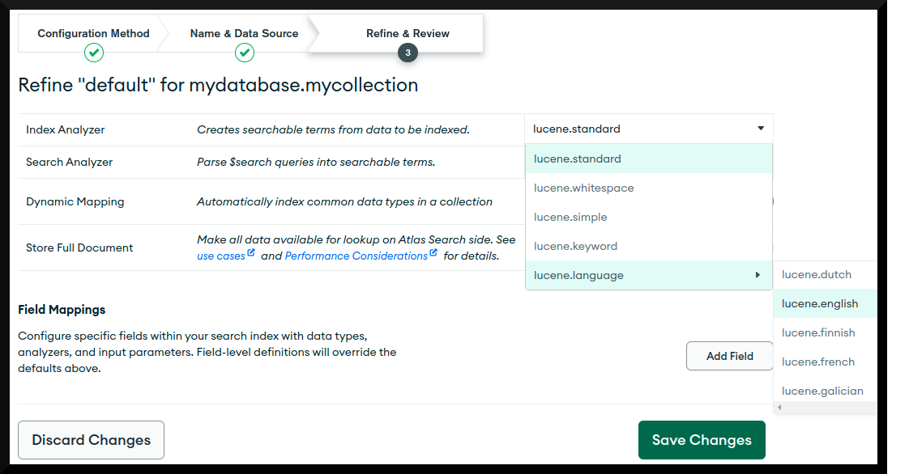

# Create Atlas Search Index

For this book's [Full-Text Search Examples](../examples/full-text-search/full-text-search.md), you need to use an Atlas Cluster rather than a self-installed MongoDB deployment. The simplest way to provision an Atlas Cluster is to [create a Free Tier Cluster](https://www.mongodb.com/cloud/atlas). Once created, use the following steps whenever one of the _Full-Text Search Examples_ chapters asks you to create a Search Index.

&nbsp;

First, in the Atlas console for your database cluster, click the **Search tab** and then click **Create Search Index**:

Select **Visual Editor** and then click **Next**:

Change **Index Name** to the value you require, select the **database** and **collection** you require and then click **Next**:

In the review screen click **Refine Your Index**:

For the **Index Analyzer** element, select **lucene.language** and then **lucene.english**, before clicking **Save Changes**:

This will also automatically change the *Search Analyzer* element to this new value, which you will typically want. Back in the review screen, click **Create Search Index** to finish. It may take a minute or two for the text search index to be created.

