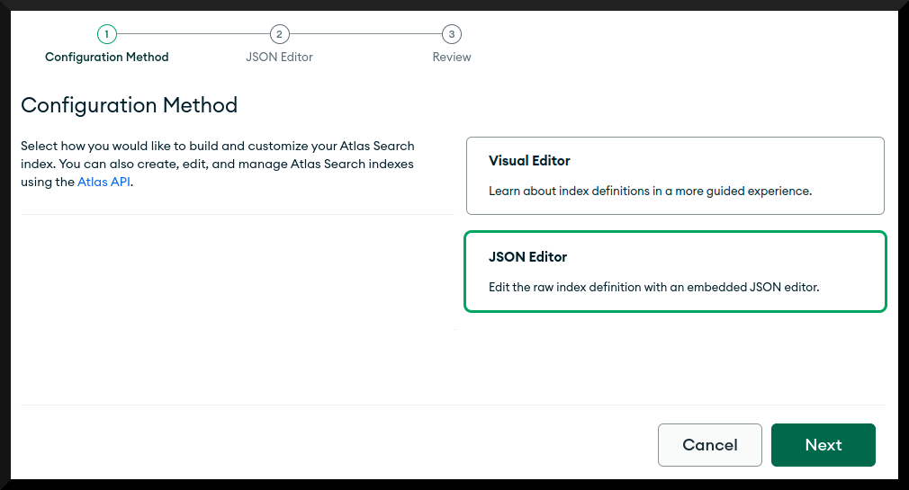
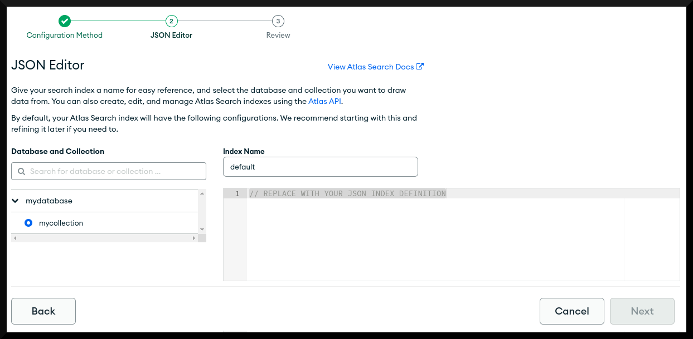
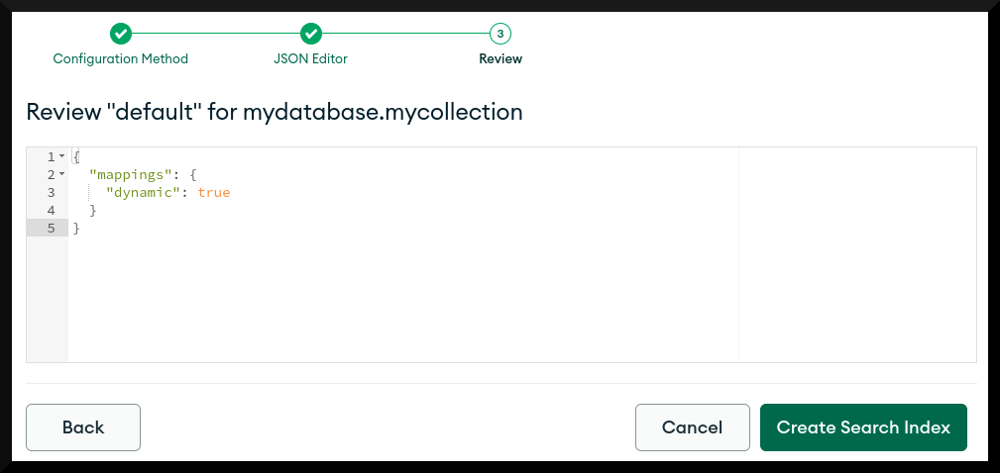

# Create Atlas Search Index

For this book's [Full-Text Search Examples](../examples/full-text-search/full-text-search.md), you need to use an Atlas Cluster rather than a self-managed MongoDB deployment. The simplest way to provision an Atlas Cluster is to [create a Free Tier Cluster](https://www.mongodb.com/cloud/atlas). Once created, use the steps below whenever a _Full-Text Search Examples_ chapter asks you to create a search index. 

---

&nbsp;

First, in the [Atlas console](https://cloud.mongodb.com/) for your database cluster, click the **Search tab** and then click **Create Search Index**:

&nbsp;

Select **JSON Editor** and then click **Next**:

&nbsp;

Leave **Index Name** as "default", select the **database** and **collection** you require, paste in your JSON index definition and then click **Next**:

&nbsp;

In the review screen, click **Create Search Index** to finish:

It may take a few minutes for the system to generate the text search index.

&nbsp;

> _Note that it is also possible for you to automate [creating a search index using the Atlas Admin API](https://www.mongodb.com/docs/atlas/reference/api/fts-indexes-create-one/#examples)._

