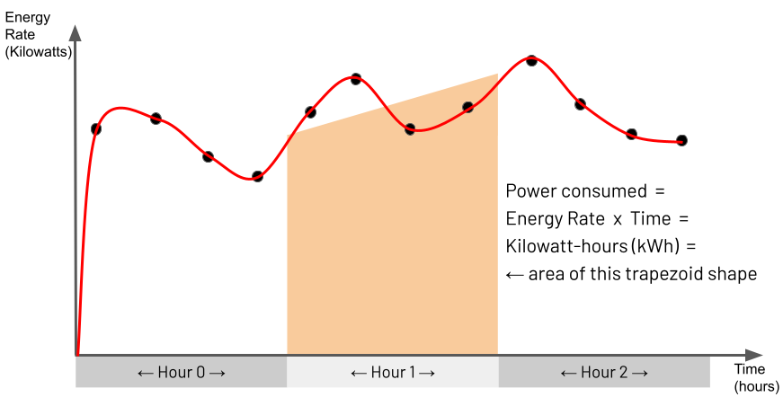

# IoT Power Consumption

__Minimum MongoDB Version:__ 5.0 &nbsp;&nbsp; _(due to use of [time series collections](https://docs.mongodb.com/manual/core/timeseries-collections/), [$setWindowFields](https://docs.mongodb.com/manual/reference/operator/aggregation/setWindowFields/) stage & [$integral](https://docs.mongodb.com/manual/reference/operator/aggregation/integral/) operator)_


## Scenario

You are monitoring various air-conditioning units running in two buildings on an industrial campus. Every 30 minutes, a device in each unit sends the unit's current power consumption reading back to base, which a central database persists. You want to analyse this data to see how much energy in kilowatt-hours (kWh) each air-conditioning unit has consumed over the last hour for each reading received. Furthermore, you want to compute the total energy consumed by all the air-conditioning units combined in each building for every hour.

## Sample Data Population

Drop any old version of the database (if it exists) and then populate a new `device_readings` collection with device readings spanning 3 hours of a day for air-conditioning units in two different buildings.

```javascript
use book-iot-power-consumption;
db.dropDatabase();

// Use a time-series collection for optimal processing
// NOTE: This command can be commented out and the full example will still work
db.createCollection("device_readings", {
  "timeseries": {
    "timeField": "timestamp",
    "metaField": "deviceID",
    "granularity": "minutes"
  }
});

// Create compound index to aid performance for partitionBy & sortBy of setWindowFields
db.device_readings.createIndex({"deviceID": 1, "timestamp": 1});

// Insert 18 records into the device readings collection
db.device_readings.insertMany([
  // 11:29am device readings
  {
    "buildingID": "Building-ABC", 
    "deviceID": "UltraAirCon-111",    
    "timestamp": ISODate("2021-07-03T11:29:59Z"),
    "powerKilowatts": 8,     
  },
  {
    "buildingID": "Building-ABC",
    "deviceID": "UltraAirCon-222",    
    "timestamp": ISODate("2021-07-03T11:29:59Z"),
    "powerKilowatts": 7,     
  },
  {
    "buildingID": "Building-XYZ",
    "deviceID": "UltraAirCon-666",    
    "timestamp": ISODate("2021-07-03T11:29:59Z"),
    "powerKilowatts": 10,     
  },
  
  // 11:59am device readings
  {
    "buildingID": "Building-ABC",
    "deviceID": "UltraAirCon-222",    
    "timestamp": ISODate("2021-07-03T11:59:59Z"),
    "powerKilowatts": 9,     
  },
  {
    "buildingID": "Building-ABC",
    "deviceID": "UltraAirCon-111",    
    "timestamp": ISODate("2021-07-03T11:59:59Z"),
    "powerKilowatts": 8,     
  },
  {
    "buildingID": "Building-XYZ",
    "deviceID": "UltraAirCon-666",    
    "timestamp": ISODate("2021-07-03T11:59:59Z"),
    "powerKilowatts": 11,     
  },
  
  // 12:29pm device readings
  {
    "buildingID": "Building-ABC",
    "deviceID": "UltraAirCon-222",    
    "timestamp": ISODate("2021-07-03T12:29:59Z"),
    "powerKilowatts": 9,     
  },
  {
    "buildingID": "Building-ABC",
    "deviceID": "UltraAirCon-111",    
    "timestamp": ISODate("2021-07-03T12:29:59Z"),
    "powerKilowatts": 9,     
  },
  {
    "buildingID": "Building-XYZ",
    "deviceID": "UltraAirCon-666",    
    "timestamp": ISODate("2021-07-03T12:29:59Z"),
    "powerKilowatts": 10,     
  },

  // 12:59pm device readings
  {
    "buildingID": "Building-ABC",
    "deviceID": "UltraAirCon-222",    
    "timestamp": ISODate("2021-07-03T12:59:59Z"),
    "powerKilowatts": 8,     
  },
  {
    "buildingID": "Building-ABC",
    "deviceID": "UltraAirCon-111",    
    "timestamp": ISODate("2021-07-03T12:59:59Z"),
    "powerKilowatts": 8,     
  },
  {
    "buildingID": "Building-XYZ",
    "deviceID": "UltraAirCon-666",    
    "timestamp": ISODate("2021-07-03T12:59:59Z"),
    "powerKilowatts": 11,     
  },

  // 13:29pm device readings
  {
    "buildingID": "Building-ABC",
    "deviceID": "UltraAirCon-222",    
    "timestamp": ISODate("2021-07-03T13:29:59Z"),
    "powerKilowatts": 9,     
  },
  {
    "buildingID": "Building-ABC",
    "deviceID": "UltraAirCon-111",    
    "timestamp": ISODate("2021-07-03T13:29:59Z"),
    "powerKilowatts": 9,     
  },
  {
    "buildingID": "Building-XYZ",
    "deviceID": "UltraAirCon-666",    
    "timestamp": ISODate("2021-07-03T13:29:59Z"),
    "powerKilowatts": 10,     
  },

  // 13:59pm device readings
  {
    "buildingID": "Building-ABC",
    "deviceID": "UltraAirCon-222",    
    "timestamp": ISODate("2021-07-03T13:59:59Z"),
    "powerKilowatts": 8,     
  },
  {
    "buildingID": "Building-ABC",
    "deviceID": "UltraAirCon-111",    
    "timestamp": ISODate("2021-07-03T13:59:59Z"),
    "powerKilowatts": 8,     
  },
  {
    "buildingID": "Building-XYZ",
    "deviceID": "UltraAirCon-666",    
    "timestamp": ISODate("2021-07-03T13:59:59Z"),
    "powerKilowatts": 11,     
  },
]);
```


## Aggregation Pipeline

Define a pipeline ready to perform an aggregation to calculate the energy an air-conditioning unit has consumed over the last hour for each reading received:

```javascript
var pipelineRawReadings = [
  // Calculate each unit's energy consumed over the last hour for each reading
  {"$setWindowFields": {
    "partitionBy": "$deviceID",
    "sortBy": {"timestamp": 1},    
    "output": {
      "consumedKilowattHours": {
        "$integral": {
          "input": "$powerKilowatts",
          "unit": "hour",
        },
        "window": {
          "range": [-1, "current"],
          "unit": "hour",
        },
      },
    },
  }},
];
```

Define a pipeline ready to compute the total energy consumed by all the air-conditioning units combined in each building for every hour:

```javascript
var pipelineBuildingsSummary = [
  // Calculate each unit's energy consumed over the last hour for each reading
  {"$setWindowFields": {
    "partitionBy": "$deviceID",
    "sortBy": {"timestamp": 1},    
    "output": {
      "consumedKilowattHours": {
        "$integral": {
          "input": "$powerKilowatts",
          "unit": "hour",
        },
        "window": {
          "range": [-1, "current"],
          "unit": "hour",
        },
      },
    },
  }},
  
  // Sort each reading by unit/device and then by timestamp
  {"$sort": {
    "deviceID": 1,
    "timestamp": 1,
  }},    
  
  // Group readings together for each hour for each device using
  // the last calculated energy consumption field for each hour
  {"$group": {
    "_id": {
      "deviceID": "$deviceID",
      "date": {
          "$dateTrunc": {
            "date": "$timestamp",
            "unit": "hour",
          }
      },
    },
    "buildingID": {"$last": "$buildingID"},
    "consumedKilowattHours": {"$last": "$consumedKilowattHours"},
  }},    

  // Sum together the energy consumption for the whole building
  // for each hour across all the units in the building   
  {"$group": {
    "_id": {
      "buildingID": "$buildingID",
      "dayHour": {"$dateToString": {"format": "%Y-%m-%d  %H", "date": "$_id.date"}},
    },
    "consumedKilowattHours": {"$sum": "$consumedKilowattHours"},
  }},    

  // Sort the results by each building and then by each hourly summary
  {"$sort": {
    "_id.buildingID": 1,
    "_id.dayHour": 1,
  }},    

  // Make the results more presentable with meaningful field names
  {"$set": {
    "buildingID": "$_id.buildingID",
    "dayHour": "$_id.dayHour",
    "_id": "$$REMOVE",
  }},      
];
```


## Execution

Execute an aggregation using the pipeline to calculate the energy an air-conditioning unit has consumed over the last hour for each reading received and also view its explain plan:

```javascript
db.device_readings.aggregate(pipelineRawReadings);
```

```javascript
db.device_readings.explain("executionStats").aggregate(pipelineRawReadings);
```

Execute an aggregation using the pipeline to compute the total energy consumed by all the air-conditioning units combined in each building for every hour and also view its explain plan:

```javascript
db.device_readings.aggregate(pipelineBuildingsSummary);
```

```javascript
db.device_readings.explain("executionStats").aggregate(pipelineBuildingsSummary);
```

## Expected Results

For the pipeline to calculate the energy an air-conditioning unit has consumed over the last hour for each reading received, results like the following should be returned (redacted for brevity - only showing the first few records):

```javascript
[
  {
    _id: ObjectId("60ed5e679ea1f9f74814ca2b"),
    buildingID: 'Building-ABC',
    deviceID: 'UltraAirCon-111',
    timestamp: ISODate("2021-07-03T11:29:59.000Z"),
    powerKilowatts: 8,
    consumedKilowattHours: 0
  },
  {
    _id: ObjectId("60ed5e679ea1f9f74814ca2f"),
    buildingID: 'Building-ABC',
    deviceID: 'UltraAirCon-111',
    timestamp: ISODate("2021-07-03T11:59:59.000Z"),
    powerKilowatts: 8,
    consumedKilowattHours: 4
  },
  {
    _id: ObjectId("60ed5e679ea1f9f74814ca32"),
    buildingID: 'Building-ABC',
    deviceID: 'UltraAirCon-111',
    timestamp: ISODate("2021-07-03T12:29:59.000Z"),
    powerKilowatts: 9,
    consumedKilowattHours: 8.25
  },
  {
    _id: ObjectId("60ed5e679ea1f9f74814ca35"),
    buildingID: 'Building-ABC',
    deviceID: 'UltraAirCon-111',
    timestamp: ISODate("2021-07-03T12:59:59.000Z"),
    powerKilowatts: 8,
    consumedKilowattHours: 8.5
  },
  {
    _id: ObjectId("60ed5e679ea1f9f74814ca38"),
    buildingID: 'Building-ABC',
    deviceID: 'UltraAirCon-111',
    timestamp: ISODate("2021-07-03T13:29:59.000Z"),
    powerKilowatts: 9,
    consumedKilowattHours: 8.5
  },
  ...
  ...
]
```

For the pipeline to compute the total energy consumed by all the air-conditioning units combined in each building for every hour, the following results should be returned:

```javascript
[
  {
    buildingID: 'Building-ABC',
    dayHour: '2021-07-03  11',
    consumedKilowattHours: 8
  },
  {
    buildingID: 'Building-ABC',
    dayHour: '2021-07-03  12',
    consumedKilowattHours: 17.25
  },
  {
    buildingID: 'Building-ABC',
    dayHour: '2021-07-03  13',
    consumedKilowattHours: 17
  },
  {
    buildingID: 'Building-XYZ',
    dayHour: '2021-07-03  11',
    consumedKilowattHours: 5.25
  },
  {
    buildingID: 'Building-XYZ',
    dayHour: '2021-07-03  12',
    consumedKilowattHours: 10.5
  },
  {
    buildingID: 'Building-XYZ',
    dayHour: '2021-07-03  13',
    consumedKilowattHours: 10.5
  }
]
```


## Observations

 * __Integral Trapezoidal Rule.__ As [documented in the MongoDB Manual](https://docs.mongodb.com/manual/reference/operator/aggregation/integral/), `$integral` _"returns an approximation for the mathematical integral value, which is calculated using the trapezoidal rule"_. For non-mathematicians, this explanation may be hard to understand. You may find it easier to comprehend the behaviour of the `$integral` operator by studying the illustration below and the explanation that follows:

     

     Essentially the [trapezoidal rule](https://en.wikipedia.org/wiki/Trapezoidal_rule) determines the area of a region between two points under a graph by matching the region with a trapezoid shape that approximately fits this region and then calculating the area of this trapezoid. You can see a set of points on the illustrated graph with the matched trapezoid shape underneath each pair of points. For this IoT Power Consumption example, the points on the graph represent an air-conditioning unit's power readings captured every 30 minutes. The Y-axis is the _power rate_ in Kilowatts, and the X-axis is _time_ to indicate when the device captured each reading. Consequently, for this example, the energy consumed by the air-conditioning unit for a given hour's span is the area of the hour's specific section under the graph. This section's area is approximately the area of the two trapezoids shown. Using the `$integral` operator for the window of time you define in the `$setWindowFields` stage, you are asking for this approximate area to be calculated, which is the Kilowatt-hours consumed by the air-conditioning unit in one hour.

 * __Window Range Definition.__ For every captured document representing a device reading, this example's pipeline identifies a window of _1-hour_ of previous documents relative to this _current_ document. The pipeline uses this set of documents as the input for the `$integral` operator. It defines this window range in the setting `range: [-1, "current"], unit: "hour"`. The pipeline assigns the output of the `$integral` calculation to a new field called `consumedKilowattHours`.

 * __One Hour Range Vs Hours Output.__ The fact that the `$setWindowFields` stage in the pipeline defines `unit: "hour"` in two places may appear redundant at face value. However, this is not the case, and each serves a different purpose. As described in the previous observation, `unit: "hour"` for the `"window"` option helps dictate the size of the window of the previous number of documents to analyse. However, `unit: "hour"` for the `$integral` operator defines that the output should be in hours ("Kilowatt-hours" in this example), yielding the result `consumedKilowattHours: 8.5` for one of the processed device readings. However, if the pipeline defined this `$integral` parameter to be `"unit": "minute"` instead, which is perfectly valid, the output value would be `510` Kilowatt-minutes (i.e. 8.5 x 60 minutes).

 * __Optional Time Series Collection.__ This example uses a [time series collection](https://docs.mongodb.com/manual/core/timeseries-collections/) to store sequences of device measurements over time efficiently. Employing a time series collection is optional, as shown in the `NOTE` Javascript comment in the example code. The aggregation pipeline does not need to be changed and achieves the same output if you use a regular collection instead. However, when dealing with large data sets, the aggregation will complete quicker by employing a time series collection.

 * __Index for Partition By & Sort By.__ In this example, you define the index `{deviceID: 1, timestamp: 1}` to optimise the use of the combination of the `partitionBy` and `sortBy` parameters in the `$setWindowFields` stage. This means that the aggregation runtime does not have to perform a slow in-memory sort based on these two fields, and it also avoids the pipeline stage memory limit of 100 MB. It is beneficial to use this index regardless of whether you employ a regular collection or adopt a time series collection.

