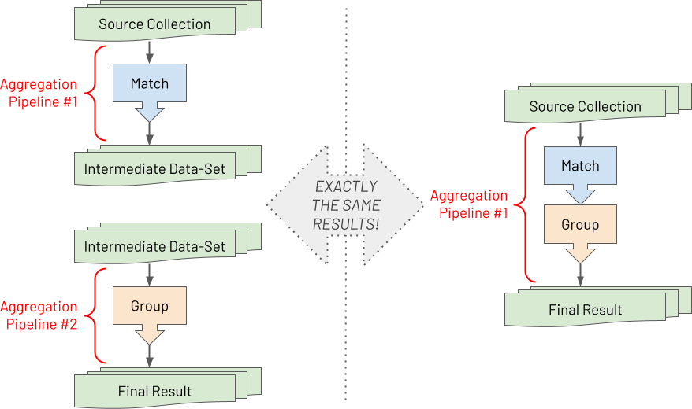

# Embrace Composability For Increased Productivity

An aggregation pipeline is an ordered series of declarative statements, called stages. The entire output of one stage forms the whole input of the next stage, and so on, with no side effects. Pipelines exhibit high [composability](https://en.wikipedia.org/wiki/Composability) where stages are stateless self-contained components selected and assembled in various combinations (pipelines) to satisfy specific requirements. This composability promotes iterative prototyping, with straightforward testing after each increment.

With MongoDB's aggregations, you can take a complex problem, requiring a complex aggregation pipeline, and break it down into straightforward individual stages, where each step can be developed and tested in isolation first. To better comprehend this composability, it may be helpful to internalise the following visual model.



Suppose you have two pipelines with one stage in each and run the second pipeline after completing the first pipeline. The final result set is the same as if you have just run a single pipeline containing both stages serially. There is no difference between the two. As a developer, you can reduce the [cognitive load](https://en.wikipedia.org/wiki/Cognitive_load) by understanding how a problem can be broken down in this way when building aggregation pipelines. Aggregation pipelines enable you to decompose a big challenge into lots of minor challenges. By embracing this approach of first developing each stage separately, you will find even the most complex challenges become surmountable.

## Specific Tips To Promote Composability

In reality, once most developers become adept at using the Aggregation Framework, they tend not to rely on temporary intermediate collections whilst prototyping each stage. However, it is still a reasonable development approach if you prefer it. Instead, seasoned aggregation pipeline developers typically comment out one or more stages of an aggregation pipeline when using MongoDB's Shell (or they use the 'disable stage' capability provided by the [GUI tools](../intro/getting-started.md) for MongoDB).

To encourage composability and hence productivity, some of the principles to strive for are:

 * Easy disabling of subsets of stages, whilst prototyping or debugging
 * Easy addition of new fields to a stage or new stages to a pipeline by performing a copy, a paste and then a modification without hitting cryptic error messages resulting from issues like missing a comma before the added element
 * Easy appreciation of each distinct stage's purpose, at a glance

With these principles in mind, the following is an opinionated list of guidelines for how you should textually craft your pipelines in JavaScript to improve your pipeline development pace:

 1. Don't start or end a stage on the same line as another stage
 2. For every field in a stage, and stage in a pipeline, include a trailing comma even if it is currently the last item
 3. Include an empty newline between every stage
 4. For complex stages include a `//` comment with an explanation on a newline before the stage
 5. To 'disable' some stages of a pipeline whilst prototyping or debugging another stage, use the multi-line comment `/*` prefix and `*/` suffix

Below is an example of a poor pipeline layout if you have followed none of the guiding principles:

```javascript
// BAD

var pipeline = [
  {"$unset": [
    "_id",
    "address"
  ]}, {"$match": {
    "dateofbirth": {"$gte": ISODate("1970-01-01T00:00:00Z")}
  }}//, {"$sort": {
  //  "dateofbirth": -1
  //}}, {"$limit": 2}
];
```

Whereas the following is an example of a far better pipeline layout, where you meet all of the guiding principles:

```javascript
// GOOD

var pipeline = [
  {"$unset": [
    "_id",
    "address",
  ]},    
    
  // Only match people born on or after 1st January 1970
  {"$match": {
    "dateofbirth": {"$gte": ISODate("1970-01-01T00:00:00Z")},
  }},
  
  /*
  {"$sort": {
    "dateofbirth": -1,
  }},      
    
  {"$limit": 2},  
  */
];
```

Notice trailing commas are included in the code snippet, at both the end of stage level and end of field level.

> _There is an important behaviour to be aware of in MongoDB's Shell after you paste and execute a pipeline's definition with `var pipeline = [...];`. The command will appear in the Shell's history, and you can press the `up` arrow key to view the command and then press `enter` to rerun it. However, in the Shell, the historic command is stored and displayed as a single line with no newline breaks. This makes it challenging to navigate and refactor part of the code, inline in the Shell, before rerunning it. Instead, it is very common for users to refactor their 'master version' of a pipeline in an external code editor before pasting it into the Shell again to rerun. Used this way, there is no problem. Nevertheless, suppose you prefer to perform inline edits of historical commands directly in the Shell. The `//` comments in your pipeline will cause an error when the command is rerun due to the historical version being a single line. The Shell will inadvertently comment out the remaining part of the pipeline's code from where the first `//` occurs. Therefore, if you are a user who favours changing a previous pipeline definition in the Shell directly, you will need to avoid the use of `//` comments. Instead, use `/* ... */` for both single-line comments and temporarily commenting out blocks of your pipeline when debugging. However, be aware that it will be more painful for you when you need to comment out a block of the pipeline that already contains a single comment line._

It is worth mentioning that some (but not all) developers take an alternative but an equally valid approach to constructing a pipeline. They decompose each stage in the pipeline into different JavaScript variables, where each stage's variable is defined separately, as shown in the example below:

```javascript
// GOOD

var unsetStage = {
  "$unset": [
    "_id",
    "address",
  ]};    

var matchStage = {
  "$match": {
    "dateofbirth": {"$gte": ISODate("1970-01-01T00:00:00Z")},
  }};

var sortStage = {
   "$sort": {
    "dateofbirth": -1,
  }}; 


var limitStage = {"$limit": 2};
    
var pipeline = [
  unsetStage,
  matchStage,
  sortStage,
  limitStage,
];
```

Furthermore, some developers may take additional steps if they do not intend to transfer the prototyped pipeline to a different programming language:

 * They may choose to decompose elements inside a stage into additional JavaScript variables to avoid code 'typos'. For instance, to prevent one part of a pipeline incorrectly referencing a field computed earlier in the pipeline due to a misspelling.
 * They may choose to factor out complex boilerplate parts of a pipeline into separate JavaScript functions. They can then re-use each function from multiple places within the main pipeline's code.

In summary, this book is not advocating a multi-variable approach over a single-variable approach when you define a pipeline. The book is just highlighting two highly composable options. Ultimately it is a personal choice concerning which you find most comfortable and productive. 

