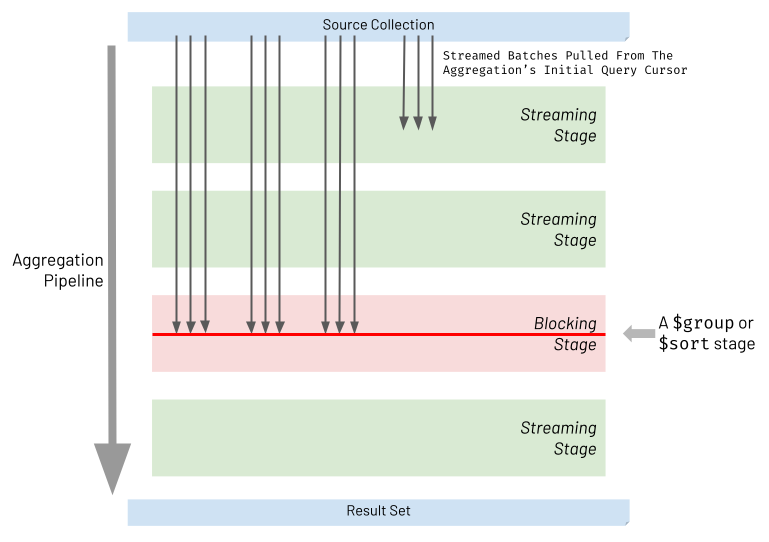

# Pipeline Performance Considerations

Similar to any programming language, there is a downside if you prematurely optimise an aggregation pipeline. You risk producing an over-complicated solution that doesn't address the performance challenges that will manifest. As described in the previous chapter, [Using Explain Plans](./explain.md), the tool you should use to identify opportunities for optimisation is the _explain plan_. You will typically use the explain plan during the final stages of your pipeline's development once it is functionally correct.

With all that said, it can still help you to be aware of some guiding principles regarding performance whilst you are prototyping a pipeline. Critically, such guiding principles will be invaluable to you once the aggregation's explain plan is analysed and if it shows that the current pipeline is sub-optimal.

This chapter outlines three crucial tips to assist you when creating and tuning an aggregation pipeline. For sizable data sets, adopting these principles may mean the difference between aggregations completing in a few seconds versus minutes, hours or even longer.


## 1. Be Cognizant Of Streaming Vs Blocking Stages Ordering

When executing an aggregation pipeline, the database engine pulls batches of records from the initial query cursor generated against the source collection. The database engine then attempts to stream each batch through the aggregation pipeline stages. For most types of stages, referred to as _streaming stages_, the database engine will take the processed batch from one stage and immediately stream it into the next part of the pipeline. It will do this without waiting for all the other batches to arrive at the prior stage. However, two types of stages must block and wait for all batches to arrive and accumulate together at that stage. These two stages are referred to as _blocking stages_ and specifically, the two types of stages that block are:

 * `$sort`
 * `$group` *
 
> \* _actually when stating `$group`, this also includes other less frequently used 'grouping' stages too, specifically:_`$bucket`, `$bucketAuto`, `$count`, `$sortByCount` & `$facet` &nbsp;_(it's a stretch to call `$facet` a group stage, but in the context of this topic, it's best to think of it that way)_

The diagram below highlights the nature of streaming and blocking stages. Streaming stages allow batches to be processed and then passed through without waiting. Blocking stages wait for the whole of the input data set to arrive and accumulate before processing all this data together.



When considering `$sort` and `$group` stages, it becomes evident why they have to block. The following examples illustrate why this is the case:

 1. __$sort blocking example__: A pipeline must sort _people_ in ascending order of _age_. If the stage only sorts each batch's content before passing the batch on to the pipeline's result, only individual batches of output records are sorted by age but not the whole result set. 
  
 2. __$group blocking example__: A pipeline must group _employees_ by one of two _work departments_ (either the _sales_ or _manufacturing_ departments). If the stage only groups employees for a batch, before passing it on, the final result contains the work departments repeated multiple times. Each duplicate department consists of some but not all of its employees. 

These often unavoidable blocking stages don't just increase aggregation execution time by reducing concurrency. If used without careful forethought, the throughput and latency of a pipeline will slow dramatically due to significantly increased memory consumption. The following sub-sections explore why this occurs and tactics to mitigate this.

### $sort Memory Consumption And Mitigation
 
Used naïvely, a `$sort` stage will need to see all the input records at once, and so the host server must have enough capacity to hold all the input data in memory. The amount of memory required depends heavily on the initial data size and the degree to which the prior stages can reduce the size. Also, multiple instances of the aggregation pipeline may be in-flight at any one time, in addition to other database workloads. These all compete for the same finite memory. Suppose the source data set is many gigabytes or even terabytes in size, and earlier pipeline stages have not reduced this size significantly. It will be unlikely that the host machine has sufficient memory to support the pipeline's blocking `$sort` stage. Therefore, MongoDB enforces every stage is limited to 100 MB of consumed RAM. The database throws an error if it exceeds this limit.

To avoid the memory limit obstacle, you can set the `allowDiskUse:true` option for the overall aggregation for handling large result data sets. Consequently, the pipeline's _sort_ operation spills to disk if required, and the 100 MB limit no longer constrains the pipeline. However, the sacrifice here is significantly higher latency, and the execution time is likely to increase by orders of magnitude.

To circumvent the aggregation needing to manifest the whole data set in memory or overspill to disk, attempt to refactor your pipeline to incorporate one of the following approaches (in order of most effective first):

 1. __Use Index Sort__. If the `$sort` stage does not depend on a `$unwind`, `$group` or `$project` stage preceding it, move the `$sort` stage to near the start of your pipeline to target an index for the sort. The aggregation runtime does not need to perform an expensive in-memory sort operation as a result. The `$sort` stage won't necessarily be the first stage in your pipeline because there may also be a `$match` stage that takes advantage of the same index. Always inspect the explain plan to ensure you are inducing the intended behaviour.
 2. __Use Limit With Sort__. If you only need the first subset of records from the sorted set of data, add a `$limit` stage directly after the `$sort` stage, limiting the results to the fixed amount you require (e.g. 10). At runtime, the aggregation engine will collapse the `$sort` and `$limit` into a single special internal sort stage which performs both actions together. The in-flight sort process only has to track the ten records in memory, which currently satisfy the executing sort/limit rule. It does not have to hold the whole data set in memory to execute the sort successfully.
 3. __Reduce Records To Sort__. Move the `$sort` stage to as late as possible in your pipeline and ensure earlier stages significantly reduce the number of records streaming into this late blocking `$sort` stage. This blocking stage will have fewer records to process and less thirst for RAM.
  
### $group Memory Consumption And Mitigation

Like the `$sort` stage, the `$group` stage has the potential to consume a large amount of memory. The aggregation pipeline's 100 MB RAM limit equally applies to the `$group` stage. As with sorting, you can use the pipeline's `allowDiskUse:true` option to avoid this limit for heavyweight grouping operations, but with the same downsides.

In reality, most grouping scenarios focus on accumulating summary data such as totals, counts, averages, highs and lows, and not itemised data. In these situations, considerably reduced result data sets are produced, requiring far less processing memory than a `$sort` stage. Contrary to many sorting scenarios, grouping operations will typically demand a fraction of the host's RAM.

To ensure you avoid excessive memory consumption when you are looking to use a `$group` stage, adopt the following principles:

 1. __Avoid Unnecessary Grouping__. This chapter covers this recommendation below, in far greater detail (section "_2. Avoid Unwinding & Regrouping Documents Just To Process Array Elements_").
 2. __Group Summary Data Only__. If the use case permits it, use the group stage to accumulate things like totals, counts and summary roll-ups only, rather than holding all the raw data of each record belonging to a group. The Aggregation Framework provides a robust set of [accumulator operators](https://docs.mongodb.com/manual/reference/operator/aggregation/#accumulators---group-) to help you achieve this inside a `$group` stage.


## 2. Avoid Unwinding & Regrouping Documents Just To Process Array Elements

Sometimes, you need an aggregation pipeline to mutate or reduce an array field's content for each record. For example:

 * You may need to add together all the values in the array into a total field
 * You may need to retain the first and last elements of the array only
 * You may need to retain only one reoccurring field for each sub-document in the array 
 * ..._or numerous other array 'reduction' scenarios_

To bring this to life, imagine a retail `orders` collection where each document contains an array of products purchased as part of the order, as shown in the example below:

```javascript
[
  {
    _id: 1197372932325,
    products: [
      {
        prod_id: 'abc12345',
        name: 'Asus Laptop',
        price: NumberDecimal('429.99')
      }
    ]
  },
  {
    _id: 4433997244387,
    products: [
      {
        prod_id: 'def45678',
        name: 'Karcher Hose Set',
        price: NumberDecimal('23.43')
      },
      {
        prod_id: 'jkl77336',
        name: 'Picky Pencil Sharpener',
        price: NumberDecimal('0.67')
      },
      {
        prod_id: 'xyz11228',
        name: 'Russell Hobbs Chrome Kettle',
        price: NumberDecimal('15.76')
      }
    ]
  }
]
```

The retailer wants to see a report of all the orders but only containing the expensive products purchased by customers (e.g. having just products priced greater than 15 dollars). Consequently, an aggregation is required to filter out the inexpensive product items of each order's array. The desired aggregation output might be:

```javascript
[
  {
    _id: 1197372932325,
    products: [
      {
        prod_id: 'abc12345',
        name: 'Asus Laptop',
        price: NumberDecimal('429.99')
      }
    ]
  },
  {
    _id: 4433997244387,
    products: [
      {
        prod_id: 'def45678',
        name: 'Karcher Hose Set',
        price: NumberDecimal('23.43')
      },
      {
        prod_id: 'xyz11228',
        name: 'Russell Hobbs Chrome Kettle',
        price: NumberDecimal('15.76')
      }
    ]
  }
]
```

Notice order `4433997244387` now only shows two products and is missing the inexpensive product.

One naïve way of achieving this transformation is to _unwind_ the _products_ array of each order document to produce an intermediate set of individual product records. These records can then be _matched_ to retain products priced greater than 15 dollars. Finally, the products can be _grouped_ back together again by each order's `_id` field. The required pipeline to achieve this is below:

```javascript
// SUBOPTIMAL

var pipeline = [
  // Unpack each product from the each order's product as a new separate record
  {"$unwind": {
    "path": "$products",
  }},

  // Match only products valued over 15.00
  {"$match": {
    "products.price": {
      "$gt": NumberDecimal("15.00"),
    },
  }},

  // Group by product type
  {"$group": {
    "_id": "$_id",
    "products": {"$push": "$products"},    
  }},
];
```

This pipeline is suboptimal because a `$group` stage has been introduced, which is a blocking stage, as outlined earlier in this chapter. Both memory consumption and execution time will increase significantly, which could be fatal for a large input data set. There is a far better alternative by using one of the [Array Operators](https://docs.mongodb.com/manual/reference/operator/aggregation/#array-expression-operators) instead. Array Operators are sometimes less intuitive to code, but they avoid introducing a blocking stage into the pipeline. Consequently, they are significantly more efficient, especially for large data sets. Shown below is a far more economical pipeline, using the `$filter` array operator, rather than the `$unwind/$match/$group` combination, to produce the same outcome:

```javascript
// OPTIMAL

var pipeline = [
  // Filter out products valued 15.00 or less
  {"$set": {
    "products": {
      "$filter": {
        "input": "$products",
        "as": "product",
        "cond": {"$gt": ["$$product.price", NumberDecimal("15.00")]},
      }
    },    
  }},
];
```

Unlike the suboptimal pipeline, the optimal pipeline will include 'empty orders' in the results for those orders that contained only inexpensive items. If this is a problem, you can include a simple `$match` stage at the start of the optimal pipeline with the same content as the `$match` stage shown in the suboptimal example.

To reiterate, there should never be the need to use an `$unwind/$group` combination in an aggregation pipeline to transform an array field's elements for each document in isolation. One way to recognize if you have this anti-pattern is if your pipeline contains a `$group` on a `$_id` field. Instead, use _Array Operators_ to avoid introducing a blocking stage. Otherwise, you will suffer a magnitude of increase in execution time when your pipeline handles more than 100MB of in-flight data. Adopting this best practice may mean the difference between achieving the required business outcome and abandoning the whole task as unachievable.

The primary use of an `$unwind/$group` combination is to correlate patterns across many records' arrays rather than transforming the content within each input record's array only. For an illustration of an appropriate use of `$unwind/$group` refer to this book's [Unpack Array & Group Differently](../examples/simple-examples/unpack-array-group-differently.md) example.


## 3. Encourage Match Filters To Appear Early In The Pipeline

As discussed, the database engine will do its best to optimise the aggregation pipeline at runtime, with a particular focus on attempting to move the `$match` stages to the top of the pipeline. Top-level `$match` content will form part of the filter that the engine first executes as the initial query. The aggregation then has the best chance of leveraging an index. However, it may not always be possible to promote `$match` filters in such a way without changing the meaning and resulting output of an aggregation.

Sometimes, a `$match` stage is defined later in a pipeline to perform a filter on a field that the pipeline computed in an earlier stage. The computed field isn't present in the pipeline's original input collection. Some examples are:

 * A pipeline where a `$group` stage creates a new `total` field based on an [accumulator operator](https://docs.mongodb.com/manual/reference/operator/aggregation/group/#accumulators-group). Later in the pipeline, a `$match` stage filters groups where each group's `total` is greater than `1000`. 
 * A pipeline where a `$set` stage computes a new `total` field value based on adding up all the elements of an array field in each document. Later in the pipeline, a `$match` stage filters documents where the `total` is less than `50`.

At first glance, it may seem like the match on the computed field is irreversibly trapped behind an earlier stage that computed the field's value. Indeed the aggregation engine cannot automatically optimise this further. In some situations, though, there may be a missed opportunity where beneficial refactoring is possible by you, the developer.

Take the following trivial example of a collection of _customer order_ documents:

```javascript
[
  {
    customer_id: 'elise_smith@myemail.com',
    orderdate: ISODate('2020-05-30T08:35:52.000Z'),
    value: NumberDecimal('9999')
  }
  {
    customer_id: 'elise_smith@myemail.com',
    orderdate: ISODate('2020-01-13T09:32:07.000Z'),
    value: NumberDecimal('10101')
  }
]
```

Let's assume the orders are in a _Dollars_ currency, and each `value` field shows the order's value in _cents_. You may have built a pipeline to display all orders where the value is greater than 100 dollars like below:

```javascript
// SUBOPTIMAL

var pipeline = [
  {"$set": {
    "value_dollars": {"$multiply": [0.01, "$value"]}, // Converts cents to dollars
  }},
  
  {"$unset": [
    "_id",
    "value",
  ]},         

  {"$match": {
    "value_dollars": {"$gte": 100},  // Peforms a dollar check
  }},    
];
```

The collection has an index defined for the `value` field (in _cents_). However, the `$match` filter uses a computed field, `value_dollars`. When you view the explain plan, you will see the pipeline does not leverage the index. The `$match` is trapped behind the `$set` stage (which computes the field) and cannot be moved to the pipeline's start. MongoDB's aggregation engine tracks a field's dependencies across multiple stages in a pipeline. It can establish how far up the pipeline it can promote fields without risking a change in the aggregation's behaviour. In this case, it knows that if it moves the `$match` stage ahead of the `$set` stage, it depends on, things will not work correctly.

In this example, as a developer, you can easily make a pipeline modification that will enable this pipeline to be more optimal without changing the pipeline's intended outcome. Change the `$match` filter to be based on the source field `value` instead (greater than `10000` cents), rather than the computed field (greater than `100` dollars). Also, ensure the `$match` stage appears before the `$unset` stage (which removes the `value` field). This change is enough to allow the pipeline to run efficiently. Below is how the pipeline looks after you have made  this change:

```javascript
// OPTIMAL

var pipeline = [
  {"$set": {
    "value_dollars": {"$multiply": [0.01, "$value"]},
  }},
  
  {"$match": {                // Moved to before the $unset
    "value": {"$gte": 10000},   // Changed to perform a cents check
  }},    

  {"$unset": [
    "_id",
    "value",
  ]},         
];
```

This pipeline produces the same data output. However, when you look at its explain plan, it shows the database engine has pushed the `$match` filter to the top of the pipeline and used an index on the `value` field. The aggregation is now optimal because the `$match` stage is no longer 'blocked' by its dependency on the computed field.

There may be some cases where you can't unravel a computed value in such a manner. However, it may still be possible for you to include an additional `$match` stage, to perform a __partial match__ targeting the aggregation's query cursor. Suppose you have a pipeline that masks the values of sensitive `date_of_birth` fields (replaced with computed `masked_date` fields). The computed field adds a random number of days (one to seven) to each current date. The pipeline already contains a `$match` stage with the filter `masked_date > 01-Jan-2020`. The runtime cannot optimise this to the top of the pipeline due to the dependency on a computed value. Nevertheless, you can manually add an extra `$match` stage at the top of the pipeline, with the filter `date_of_birth > 25-Dec-2019`. This new `$match` leverages an index and filters records seven days earlier than the existing `$match`, but the aggregation's final output is the same. The new `$match` may pass on a few more records than intended. However, later on, the pipeline applies the existing filter `masked_date > 01-Jan-2020` that will naturally remove surviving surplus records before the pipeline completes.

In summary, if you have a pipeline leveraging a `$match` stage and the explain plan shows this is not moving to the start of the pipeline, explore whether manually refactoring will help. If the `$match` filter depends on a computed value, examine if you can alter this or add an extra `$match` to yield a more efficient pipeline.

