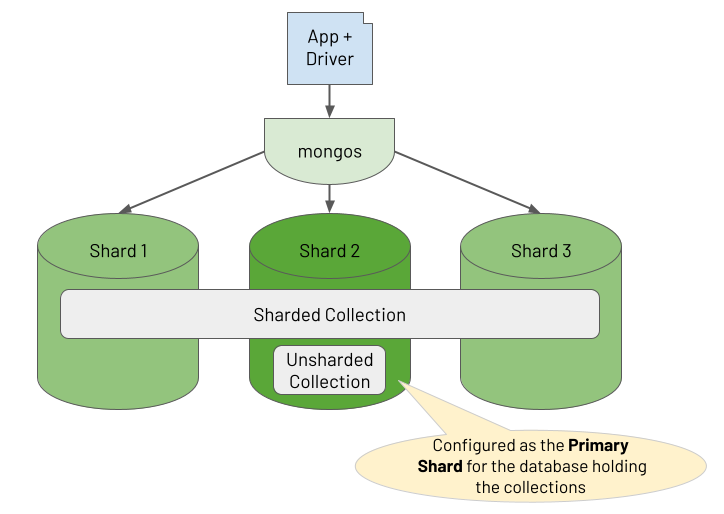
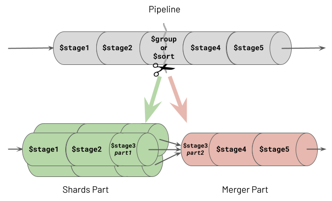
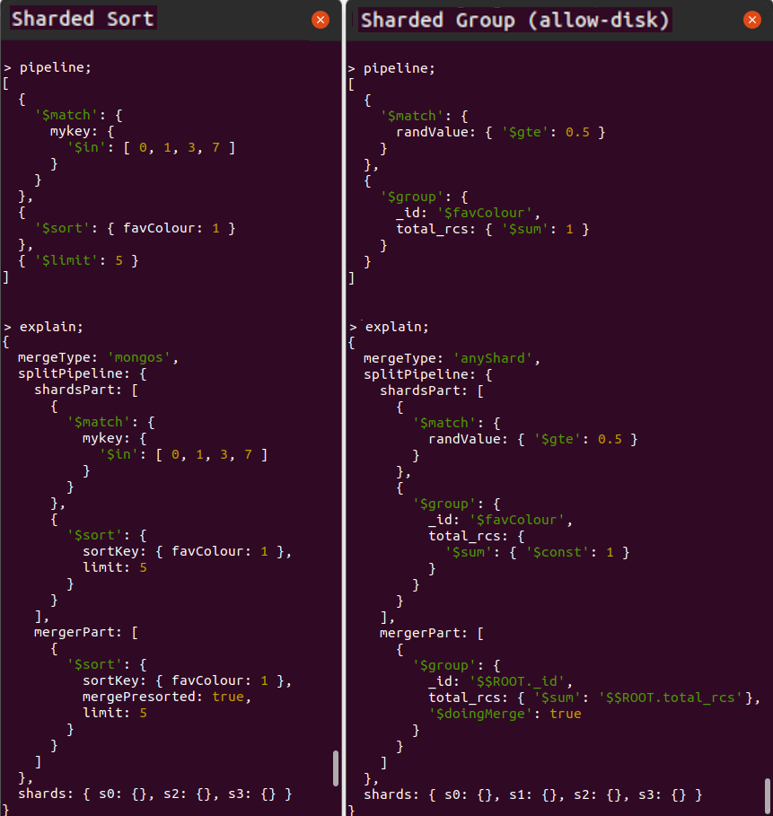
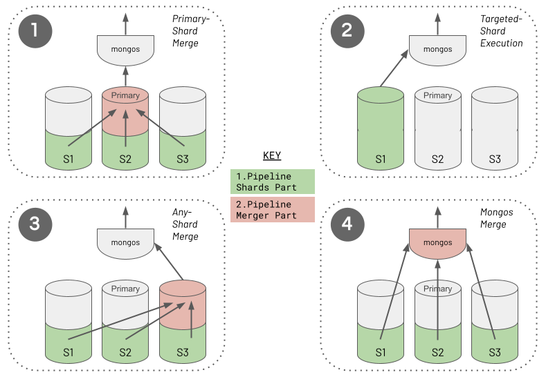

# Sharding Considerations

[MongoDB Sharding](https://docs.mongodb.com/manual/sharding/) isn't just an effective way to scale out your database to hold more data and support higher transactional throughput. Sharding also helps you scale out your analytical workloads, potentially enabling aggregations to complete far quicker. Depending on the nature of your aggregation and some adherence to best practices, the cluster may execute parts of the aggregation in parallel over multiple shards for faster completion.
 
There is no difference between a replica set and a sharded cluster regarding the functional capabilities of the aggregations you build, except for a minimal set of constraints. This chapter's _[Sharded Aggregation Constraints](#sharded-aggregation-constraints)_ section outlines these constraints. When it comes to optimising your aggregations, in most cases, there will be little to no difference in the structure of a pipeline when refactoring for performance on a sharded cluster compared to a simple replica set. You should always adhere to the advice outlined in the chapter [Pipeline Performance Considerations](../guides/performance.md). The aggregation runtime takes care of distributing the appropriate parts of your pipeline to each shard that holds the required data. The runtime then transparently coalesces the results from these shards in the most optimal way possible. Nevertheless, it is worth understanding how the aggregation engine distributes work and applies its sharded optimisations in case you ever suffer a performance problem and need to dig deeper into why.

## Brief Summary Of Sharded Clusters

In a sharded cluster, you partition a collection of data across multiple shards, where each shard runs on a separate set of host machines. You control how the system distributes the data by defining a shard key rule. Based on the shard key of each document, the system groups subsets of documents together into "chunks", where a range of shard key values identifies each chunk. The cluster balances these chunks across its shards.

In addition to holding sharded collections in a database, you may also be storing unsharded collections in the same database. All of a database's unsharded collections live on one specific shard in the cluster, designated as the "primary shard" for the database (not to be confused with a replica set's "primary replica"). The diagram below shows the relationship between a database's collections and the shards in the cluster.

One or more deployed [mongos](https://docs.mongodb.com/manual/reference/program/mongos/) processes act as a [reverse proxy](https://en.wikipedia.org/wiki/Reverse_proxy), routing read and write operations from the client application to the appropriate shards. For document write operations (i.e. create, update, delete), a mongos router knows which shard the document lives on and routes the operation to that specific shard. For read operations, if the query includes the shard key, the mongos knows which shards hold the required documents to route the query to (called "targeting"). If the query does not include the shard key, it sends the query to all shards using a "scatter/gather" pattern (called "broadcasting"). These are the rules for sharded reads and writes, but the approach for sharded aggregations requires a deeper explanation. Consequently, the rest of this chapter outlines how a sharded cluster handles the routing and execution of aggregations.

## Sharded Aggregation Constraints

Some of MongoDB's stages are only partly supported for sharded aggregations depending on which version of MongoDB you are running. These stages all happen to reference a second collection in addition to the pipeline's source input collection. The pipeline can use a sharded collection as its source in each case, but the second collection referenced must be unsharded. The affected stages and versions are:

 * __`$lookup`__. In MongoDB versions prior to 5.1, the other referenced collection to join with must be unsharded.
 
 * __`$graphLookup`__. In MongoDB versions prior to 5.1, the other referenced collection to recursively traverse must be unsharded.
 
 * __`$out`__. In all MongoDB versions, the other referenced collection used as the destination of the aggregation's output must be unsharded. However, you can use a `$merge` stage instead to output the aggregation result to a sharded collection.

## Where Does A Sharded Aggregation Run?

Sharded clusters provide the opportunity to reduce the response times of aggregations. For example, there may be an unsharded collection containing billions of documents where it takes 60 seconds for an aggregation pipeline to process all this data. Instead, suppose a cluster of four shards is hosting this same collection of evenly balanced data. Depending on the nature of the aggregation, it may be possible for the cluster to execute the aggregation's pipeline concurrently on each shard. Consequently, the same aggregation's total data processing time may be closer to 15 seconds. However, this won't always be the case because certain types of pipelines will demand combining substantial amounts of data from multiple shards for further processing. The aggregation's response time could go in the opposite direction in such circumstances, completing in far longer than 60 seconds due to the significant network transfer and marshalling overhead. 

### Pipeline Splitting At Runtime
A sharded cluster will attempt to execute as many of a pipeline's stages as possible, in parallel, on each shard containing the required data. However, certain types of stages must operate on all the data in one place. Specifically, these are the sorting and grouping stages, collectively referred to as the "blocking stages" (described in the chapter [Pipeline Performance Considerations](../guides/performance.md)). Upon the first occurrence of a blocking stage in the pipeline, the aggregation engine will split the pipeline into two parts at the point where the blocking stage occurs. The Aggregation Framework refers to the first section of the divided pipeline as the "Shards Part", which can run concurrently on multiple shards. The remaining portion of the split pipeline is called the "Merger Part", which executes in one location. The following illustration shows how this pipeline division occurs.

One of the two stages which causes a split, shown as stage 3, is a `$group` stage. The same behaviour actually occurs with all grouping stages, specifically `$bucket`, `$bucketAuto`, `$count` and `$sortByCount`. Therefore any mention of the `$group` stage in this chapter is synonymous with all of these grouping stages. 

You can see two examples of aggregation pipeline splitting in action in the MongoDB Shell screenshots displayed below, showing each pipeline and its explain plan. The cluster contains four shards ("_s0_", "_s1_", "_s2_" and "_s3_") which hold the distributed collection. The two example aggregations perform the following actions respectively:

 1. Sharded sort, matching on shard key values and limiting the number of results
 
 2. Sharded group, matching on non-shard key values with `allowDiskUse:true` and showing the total number of records per group

You can observe some interesting behaviours from these two explain plans:

 * __Shards Part Of Pipeline Running In Parallel__. In both cases, the pipeline's `shardsPart` executes on multiple shards, as indicated in the shards array field at the base of the explain plan. In the first example, the aggregation runtime targets only three shards. However, in the second example, the runtime must broadcast the pipeline's `shardsPart` to run on all shards - the section _[Execution Of The Shards Part Of The Split Pipeline](#execution-of-the-shards-part-of-the-split-pipeline)_ in this chapter discusses why.
 
 * __Optimisations Applied In Shards Part__. For the `$sort` or `$group` blocking stages where the pipeline splits, the blocking stage divides into two. The runtime executes the first phase of the blocking stage as the last stage of the `shardsPart` of the divided pipeline. It then completes the stage's remaining work as the first stage of the `mergerPart`. For a `$sort` stage, this means the cluster conducts a large portion of the sorting work in parallel on all shards, with a remaining "merge sort" occurring at the final location. For a `$group` stage, the cluster performs the grouping in parallel on every shard, accumulating partial sums and totals ahead of its final merge phase. Consequently, the runtime does not have to ship masses of raw ungrouped data from the source shards to where the runtime merges the partially formed groups.
 
 * __Merger Part Running From A Single Location__. The specific location where the runtime executes the pipeline's `mergerPart` stages depends on several variables. The explain plan shows the location chosen by the runtime in the mergeType field of its output. In these two examples, the locations are `mongos` and `anyShard`, respectively. This chapter's _[Execution Of The Merger Part Of The Split Pipeline](#execution-of-the-merger-part-of-the-split-pipeline-if-any)_ section outlines the rules that the aggregation runtime uses to decide this location.
 
 * __Final Merge Sorting When The Sort Stage Is Split__. The `$sort`'s final phase shown in the `mergerPart` of the first pipeline is not a blocking operation, whereas, with `$group` shown in the second pipeline, `$group`'s final phase is blocking. This chapter's _[Difference In Merging Behaviour For Grouping Vs Sorting](#difference-in-merging-behaviour-for-grouping-vs-sorting)_ section discusses why.

 > _Unfortunately, if you are running your aggregations in MongoDB versions 4.2 to 5.2, the explain plan generated by the aggregation runtime erroneously neglects to log the final phase of the `$sort` stage in the pipeline's `mergerPart`. This is caused by an [explain plan bug](https://jira.mongodb.org/browse/SERVER-57383) but rest assured that the final phase of the `$sort` stage (the "merge sort") does indeed happen in the pipeline's `mergerPart`._

### Execution Of The Shards Part Of The Split Pipeline

When a mongos receives a request to execute an aggregation pipeline, it needs to determine where to target the _shards part_ of the pipeline. It will endeavour to run this on the relevant subset of shards rather than broadcasting the work to all. 

Suppose there is a `$match` stage occurring at the start of the pipeline. If the filter for this `$match` includes the shard key or a prefix of the shard key, the mongos can perform a targeted operation. It routes the _shards part_ of the split pipeline to execute on the applicable shards only.

Furthermore, suppose the runtime establishes that the `$match`'s filter contains an exact match on a shard key value for the source collection. In that case, the pipeline can target a single shard only, and doesn't even need to split the pipeline into two. The entire pipeline runs in one place, on the one shard where the data it needs lives. Even if the `$match`'s filter only has a partial match on the first part of the shard key (the "prefix"), if this spans a range of documents encapsulated within a single chunk, or multiple chunks on the same shard only, the runtime will just target the single shard.

### Execution Of The Merger Part Of The Split Pipeline (If Any)

The aggregation runtime applies a set of rules to determine where to execute the _merger part_ of an aggregation pipeline for a sharded cluster and whether a split is even necessary. The following diagram captures the four different approaches the runtime will choose from.

The aggregation runtime selects the _merger part_ location (if any) by following a decision tree, with four possible outcomes. The list below outlines the ordered decisions the runtime takes. However, it is crucial to understand that this order does not reflect precedence or preference. Achieving either the _Targeted-Shard Execution_ (2) or _Mongos Merge_ (4) is usually the preferred outcome for optimum performance.

 1. __Primary-Shard Merge__. When the pipeline contains a stage referencing an unsharded collection, the aggregation runtime will place this stage in the _merger part_ of the split pipeline. It executes this _merger part_ on the designated primary shard, which holds the unsharded collection. This is always the case for the types of stages that only reference unsharded collections (i.e. `$lookup`, `$graphLookup` or `$out`). This is also the situation if you use a `$merge` stage and the collection you specify happens to be unsharded.

 2. __Targeted-Shard Execution__. As discussed earlier, if the runtime can ensure the pipeline matches to just one shard, it does not split the pipeline, and there is no _merger part_. Instead, the runtime executes the entire pipeline on the one matched shard, just like it would for non-sharded deployments. This optimisation avoids unnecessarily breaking the pipeline into two parts, where intermediate data then has to move from the _shards part(s)_ to the _merger part_.

 3. __Any-Shard Merge__. Suppose you've configured `allowDiskUse:true` for the aggregation to avoid the 100 MB memory consumption limit per stage. If one of the following two situations is also true, the aggregation runtime must run the _merger part_ of the split pipeline on a randomly chosen shard (a.k.a. "any shard"):

     - The pipeline contains a grouping stage (which is where the split occurs),&nbsp; _or_
     - The pipeline contains a `$sort` stage (which is where the split occurs), and a subsequent blocking stage (a grouping or `$sort` stage) occurs later.

     For these cases, the runtime picks a shard to execute the merger, rather than merging on the mongos, to maximise the likelihood that the host machine has enough storage space to spill to disk. Invariably, each shard's host machine will have greater storage capacity than the host machine of a mongos. Consequently, the runtime must take this caution because, with `allowDiskUse:true`, you are indicating the likelihood that your pipeline will cause memory capacity pressure. Notably, the aggregation runtime does not need to mitigate the same risk by merging on a shard for the other type of blocking stage (a `$sort`) when `$sort` is the only blocking stage in the pipeline. You can read why a single `$sort` stage can be treated differently and does not need the same host storage capacity for merging in this chapter's _[Difference In Merging Behaviour For Grouping Vs Sorting](#difference-in-merging-behaviour-for-grouping-vs-sorting)_ section.

 4. __Mongos Merge__. This is the default approach and location. The aggregation runtime will perform the _merger part_ of the split pipeline on the mongos that instigated the aggregation in all the remaining situations. If the pipeline's _merger part_ only contains streaming stages (described in the chapter [Pipeline Performance Considerations](../guides/performance.md)), the runtime assumes it is safe for the mongos to run the remaining pipeline. A mongos has no concept of local storage to hold data. However, it doesn't matter in this situation because the runtime won't need to write to disk as RAM pressure will be minimal. The category of streaming tasks that supports a Mongos Merge also includes the final phase of a split `$sort` stage, which processes data in a streaming fashion without needing to block to see all the data together. Additionally, suppose you have defined `allowDiskUse:false` (the default). In that case, you are signalling that even if the pipeline has a `$group` stage (or a `$sort` stage followed by another blocking stage), these blocking activities will not need to overspill to disk. Performing the final merge on the mongos is the default because fewer network data transfer hops are required to fulfil the aggregation, thus reducing latency compared with merging on "any shard".

Regardless of where the _merger part_ runs, the mongos is always responsible for streaming the aggregation's final batches of results back to the client application. 

It is worth considering when no blocking stages exist in a pipeline. In this case, the runtime executes the entire pipeline in parallel on the relevant shards and the runtime streams each shard's output directly to the mongos. You can regard this as just another variation of the default behaviour (_4 - Mongos Merge_). All the stages in the aggregation constitute just the _shards part_ of the pipeline, and the mongos "stream merges" the final data through to the client. 

### Difference In Merging Behaviour For Grouping Vs Sorting

You will have read in the [Pipeline Performance Considerations](../guides/performance.md) chapter about `$sort` and `$group` stages being blocking stages and potentially consuming copious RAM. Consequently, you may be confused by the statement that, unlike a `$group` stage, when the pipeline splits, the aggregation runtime will finalise a `$sort` stage on a mongos even if you specify `allowDiskUse:true`. This is because the final phase of a split `$sort` stage is not a blocking activity, whereas the final phase of a split `$group` stage is. For `$group`, the pipeline's _merger part_ must wait for all the data coming out of all the targeted shards. For `$sort`, the runtime executes a streaming merge sort operation, only waiting for the next batch of records coming out of each shard. As long as it can see the first of the sorted documents in the next batch from every shard, it knows which documents it can immediately process and stream on to the rest of the pipeline. It doesn't have to block waiting to see all of the records to guarantee correct ordering. 

This optimisation doesn't mean that MongoDB has magically found a way to avoid a `$sort` stage being a blocking stage in a sharded cluster. It hasn't. The first phase of the `$sort` stage, run on each shard in parallel, is still blocking, waiting to see all the matched input data for that shard. However, the final phase of the same `$sort` stage, executed at the merge location, does not need to block. 

### Summarising Sharded Pipeline Execution Approaches

In summary, the aggregation runtime seeks to execute a pipeline on the subset of shards containing the required data only. If the runtime must split the pipeline to perform grouping or sorting, it completes the final merge work on a mongos, when possible. Merging on a mongos helps to reduce the number of required network hops and the execution time.

## Performance Tips For Sharded Aggregations

All the recommended aggregation optimisations outlined in the [Pipeline Performance Considerations](../guides/performance.md) chapter equally apply to a sharded cluster. In fact, in most cases, these same recommendations, repeated below, become even more critical when executing aggregations on sharded clusters: 

 1. __Sorting - Use Index Sort__. When the runtime has to split on a `$sort` stage, the _shards part_ of the split pipeline running on each shard in parallel will avoid an expensive in-memory sort operation.
 
 2. __Sorting - Use Limit With Sort__. The runtime has to transfer fewer intermediate records over the network, from each shard performing the _shards part_ of a split pipeline to the location that executes the pipeline's _merger part_.
 
 3. __Sorting - Reduce Records To Sort__. If you cannot adopt point 1 or 2, moving a `$sort` stage to as late as possible in a pipeline will typically benefit performance in a sharded cluster. Wherever the `$sort` stage appears in a pipeline, the aggregation runtime will split the pipeline at this point (unless preceded by a `$group` stage which would cause the split earlier). By promoting other activities to occur in the pipeline first, the hope is these reduce the number of records entering the blocking `$sort` stage. This sorting operation, executing in parallel at the end of _shards part_ of the split pipeline, will exhibit less memory pressure. The runtime will also stream fewer records over the network to the split pipeline's _merger part_ location.
 
 4. __Grouping - Avoid Unnecessary Grouping__. Using array operators where possible instead of `$unwind` and `$group` stages will mean that the runtime does not need to split the pipeline due to an unnecessarily introduced `$group` stage. Consequently, the aggregation can efficiently process and stream data directly to the mongos rather than flowing through an intermediary shard first.
 
 5. __Grouping - Group Summary Data Only__. The runtime has to move fewer computed records over the network from each shard performing the _shards part_ of a split pipeline to the _merger part_'s location.
 
 6. __Encourage Match Filters To Appear Early In The Pipeline__. By filtering out a large subset of records on each shard when performing the _shards part_ of the split pipeline, the runtime needs to stream fewer records to the _merger part_ location.

Specifically for sharded clusters, there are two further performance optimisations you should aspire to achieve:

 1. __Look For Opportunities To Target Aggregations To One Shard Only__. If possible, include a `$match` stage with a filter on a shard key value (or shard key prefix value). 
 
 2. __Look For Opportunities For A Split Pipeline To Merge On A Mongos__. If the pipeline has a `$group` stage (or a `$sort` stage followed by a `$group`/`$sort` stage) which causes the pipeline to divide, avoid specifying `allowDiskUse:true` if possible. This reduces the amount of intermediate data transferred over the network, thus reducing latency.

