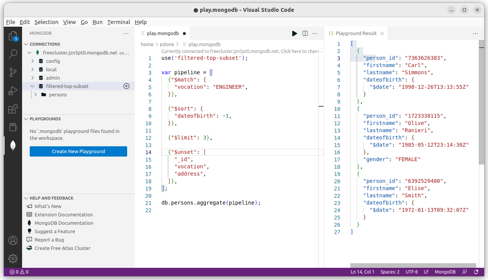
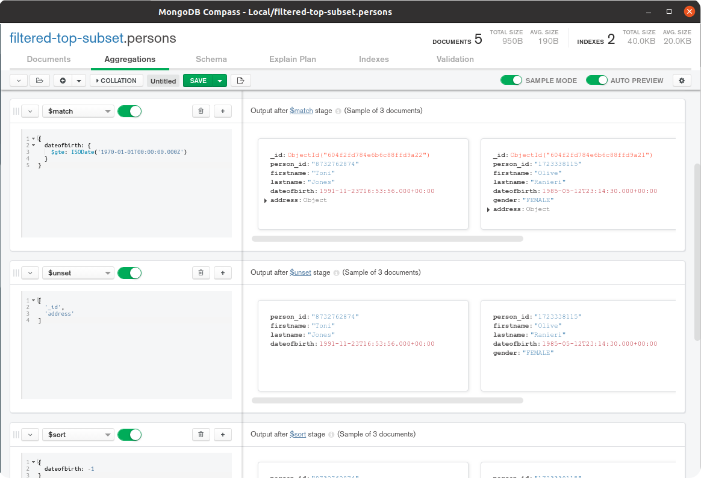
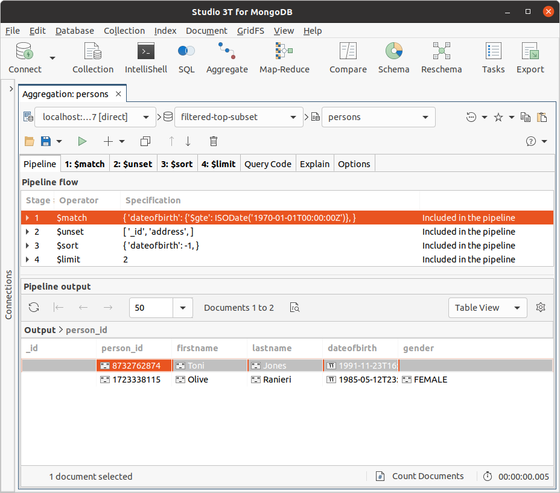

# Getting Started

For developing aggregation pipelines effectively, and also to try the examples in the second half of this book, you need the following two elements:

 1. A __MongoDB database__, __version 4.2 or greater__, running somewhere which is network accessible from your workstation
 2. A __MongoDB client tool__ running on your workstation with which to submit aggregation execution requests and to view the results

Note that each example aggregation pipeline shown in the second major part of this book is marked with the minimum version of MongoDB that you must use to execute the pipeline. A few of the example pipelines use aggregation features that MongoDB introduced in releases following version 4.2.


## Database

The database deployment for you to connect to can be a single server, a replica set or a sharded cluster. You can run this deployment locally on your workstation or remotely on-prem or in the cloud. It doesn't matter which. You need to know the MongoDB URL for connecting to the database and, if authentication is enabled, the credentials required for full read and write access.

If you don't already have access to a MongoDB database, the two most accessible options for running a database for free are:

 1. [Provision a Free Tier MongoDB Cluster](https://www.mongodb.com/cloud/atlas) in MongoDB Atlas, which is MongoDB Inc.'s cloud-based Database-as-a-Service (once deployed, in the Atlas Console, there is a button you can click to copy the URL of the cluster)
 2. [Install and run a MongoDB single server](https://docs.mongodb.com/guides/server/install/) locally on your workstation

Note that the aggregation pipelines in the [Full-Text Search Examples](../examples/full-text-search/full-text-search.md) section leverage [Atlas Search](https://www.mongodb.com/docs/atlas/atlas-search/atlas-search-overview/). Consequently, you must use Atlas for your database deployment if you want to run those examples.


## Client Tool

There are many options for the client tool, some of which are:

 1. __*Modern* Shell__. Install the modern version of MongoDB's command-line tool, the [MongoDB Shell](https://www.mongodb.com/try/download/shell): `mongosh`
 2. __*Legacy* Shell__. Install the legacy version of MongoDB's command-line tool, the [Mongo Shell](https://docs.mongodb.com/manual/mongo/): `mongo` (you will often find this binary bundled with a MongoDB database installation)
 3. __VS Code__. [Install MongoDB for VS Code](https://www.mongodb.com/docs/mongodb-vscode/install/), and use the [Playgrounds](https://www.mongodb.com/docs/mongodb-vscode/playgrounds/) feature
 4. __Compass__. Install the _official_ MongoDB Inc. provided graphical user interface (GUI) tool, [MongoDB Compass](https://www.mongodb.com/products/compass)
 5. __Studio 3T__. Install the _3rd party_ 3T Software Labs provided graphical user interface (GUI) tool, [Studio 3T](https://studio3t.com/download/)
 
The book's examples present code in such a way to make it easy to copy and paste into MongoDB's Shell (`mongosh` or `mongo`) to execute. All subsequent instructions in this book assume you are using the Shell. However, you will find it straightforward to use one of the mentioned GUI tools instead to consume the code examples. Of the two Shell versions, is it is easier to use and view results with the _modern_ Shell.


### MongoDB Shell With Atlas Database

Here is an example of how you can start the _modern_ Shell to connect to an Atlas Free Tier MongoDB Cluster (change the text `mongosh` to `mongo` if you are using the _legacy_ Shell):

```bash
mongosh "mongodb+srv://mycluster.a123b.mongodb.net/test" --username myuser
```

Note before running the command above, ensure:
 1. You have [added your workstation's IP address](https://docs.atlas.mongodb.com/security/add-ip-address-to-list/) to the Atlas Access List
 2. You have [created a database user](https://docs.atlas.mongodb.com/tutorial/create-mongodb-user-for-cluster/) for the deployed Atlas cluster, with rights to create, read and write to any database
 3. You have changed the dummy URL and username text, shown in the above example command, to match your real cluster's details (these details are accessible via the cluster's `Connect` button in the Atlas Console)


### MongoDB Shell With Local Database

Here is an example of how you can start the _modern_ Shell to connect to a MongoDB single server database if you've installed one locally on your workstation (change the text `mongosh` to `mongo` if you are using the _legacy_ Shell):

```bash
mongosh "mongodb://localhost:27017"
```

### MongoDB For VS Code

Using the MongoDB _playground_ tool in VS Code, you can quickly prototype queries and aggregation pipelines and then execute them against a MongoDB database with the results shown in an output tab. Below is a screenshot of the playground tool in action:




### MongoDB Compass GUI

MongoDB Compass provides an _Aggregation Pipeline Builder_ tool to assist users in prototyping and debugging aggregation pipelines and exporting them to different programming languages. Below is a screenshot of the aggregation tool in Compass:




### Studio 3T GUI

Studio 3T provides an _Aggregation Editor_ tool to help users prototype and debug aggregation pipelines and translate them to different programming languages. Below is a screenshot of the aggregation tool in Studio 3T:



