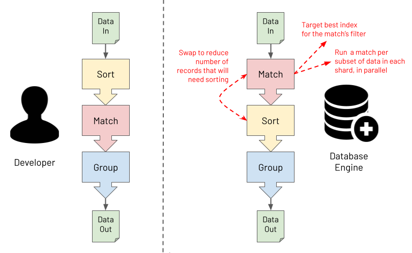

# Introducing MongoDB Aggregations

## What Is The Aggregation Framework?

MongoDB's aggregation pipeline language is somewhat of a paradox. It can appear daunting, yet it is straightforward. It can seem verbose, yet it is lean and to the point. It is [Turing complete](https://en.wikipedia.org/wiki/Turing_completeness) and able to solve any business problem __*__. Conversely, it is a strongly opinionated [Domain Specific Language (DSL)](https://en.wikipedia.org/wiki/Domain-specific_language), where, if you attempt to veer away from its core purpose of mass data manipulation, it will try its best to resist you.

> __*__ _As [John Page](http://ilearnasigoalong.blogspot.com/) once showed, you can even code a [Bitcoin miner](https://github.com/johnlpage/MongoAggMiner) using MongoDB aggregations, not that he (or hopefully anyone for that matter) would ever recommend you do this for real, for both the sake of your bank balance and the environment!_

Invariably, for beginners, the Aggregation Framework seems difficult to understand and comes with an initially steep learning curve that you must overcome to become productive. In some programming languages, you only need to master a small set of the language's aspects to be largely effective. With MongoDB aggregations, the initial effort you must invest is slightly greater. However, once mastered, users find it provides an elegant, natural and efficient solution to breaking down a complex set of data manipulations into a series of simple easy to understand steps. This is the point when users achieve the Zen of MongoDB Aggregations, and it is a lovely place to be.

MongoDB's aggregation pipeline language is focused on data-oriented problem-solving rather than business process problem-solving. It is essentially a [declarative programming language](https://en.wikipedia.org/wiki/Declarative_programming), rather than an [imperative programming language](https://en.wikipedia.org/wiki/Imperative_programming). Also, depending on how you squint, it can be regarded as a [functional programming language](https://en.wikipedia.org/wiki/Functional_programming) rather than a [procedural programming language](https://en.wikipedia.org/wiki/Procedural_programming). Why? Well, an aggregation pipeline is an ordered series of declarative statements, called stages, where the entire output of one stage forms the entire input of the next stage, and so on, with no side effects. This functional nature is probably why many users regard the Aggregation Framework as having a steeper learning curve than many languages. Not because it is inherently more difficult to understand but because most developers come from a procedural programming background and not a functional one. Most developers also have to learn how to think like a functional programmer to learn the Aggregation Framework.

The Aggregation Framework's declarative and functional characteristics ultimately make it especially powerful for processing massive data sets. Users focus more on defining 'the what' in terms of the required outcome in a declarative way. Users focus less on 'the how' of specifying the exact logic to apply to achieve each transformation. You provide one specific and clear advertised purpose for each stage in the pipeline. At runtime, the database engine can then understand the exact intent of each stage. For example, the database engine can obtain clear answers to the questions it asks, such as, "is this stage for performing a filter or is this stage for grouping on some fields?". With this knowledge, the database engine has the opportunity to optimise the pipeline at runtime. The diagram below shows an example of the database performing a pipeline optimisation. It may decide to re-order stages to optimally leverage an index whilst ensuring that the output isn't changed. Or, it may choose to execute some steps in parallel against subsets of the data in different shards, reducing response time whilst again ensuring the output is never changed.

Last and by far least in terms of importance is a discussion about syntax. So far, MongoDB aggregations have been described here as a programming language, which it is (a Domain Specific Language). However, with what syntax is a MongoDB aggregation pipeline constructed? The answer is "it depends", and the answer is mostly irrelevant. This book will highlight pipeline examples using the Mongo Shell and the JavaScript interpreter it runs in. The book will express aggregation pipelines using a [JSON](https://en.wikipedia.org/wiki/JSON) based syntax. However, if you are using one of the many [programming language drivers](https://docs.mongodb.com/drivers/) that MongoDB provides, you will be using that language to construct an aggregation pipeline, not JSON. An aggregation is specified as an array of objects, regardless of how the programming language may facilitate this. This programmatic rather than textual format has a couple of advantages compared to querying with a string. It has a low vulnerability to [injection attacks](https://en.wikipedia.org/wiki/SQL_injection), and it is highly [composable](https://en.wikipedia.org/wiki/Composability).

## What's In A Name?

You might have realised by now that there doesn't seem to be one single name for the subject of this book. You will often hear:

* Aggregation
* Aggregations
* Aggregation Framework
* Aggregation Pipeline
* Aggregation Pipelines
* Aggregation Language
* Agg
* _...and so on_

The reality is that any of these names are acceptable, and it doesn't matter which you use. This book uses most of these terms at some point. Just take it as a positive sign that this MongoDB capability (and its title) was not born in a marketing boardroom. It was built by database engineers, for data engineers, where the branding was an afterthought at best!

## What Do People Use The Aggregation Framework For?

The Aggregation Framework is versatile and used for many different data processing and manipulation tasks. Some typical example uses are for:

* Real-time analytics
* Report generation with roll-ups, sums & averages
* Real-time dashboards
* Redacting data to present via views
* Joining data together from different collections on the 'server-side'
* Data science, including data discovery and data wrangling
* Mass data analysis at scale (a la '[big data](https://en.wikipedia.org/wiki/Big_data)')
* Real-time queries where deeper 'server-side' data post-processing is required than provided by the MongoDB Query Language ([MQL](https://docs.mongodb.com/manual/crud/))
* Copying and transforming subsets of data from one collection to another
* Navigating relationships between records, looking for patterns
* Data masking to obfuscate sensitive data
* Performing the Transform (T) part of an Extract-Load-Transform ([ELT](https://en.wikipedia.org/wiki/Extract,_load,_transform)) workload
* Data quality reporting and cleansing
* Updating a materialised view with the results of the most recent source data changes
* Representing data ready to be exposed via SQL/ODBC/JDBC (using MongoDB's [BI Connector](https://docs.mongodb.com/bi-connector/))
* Supporting machine learning frameworks for efficient data analysis (e.g. via MongoDB's [Spark Connector](https://docs.mongodb.com/spark-connector))
* _...and many more_

